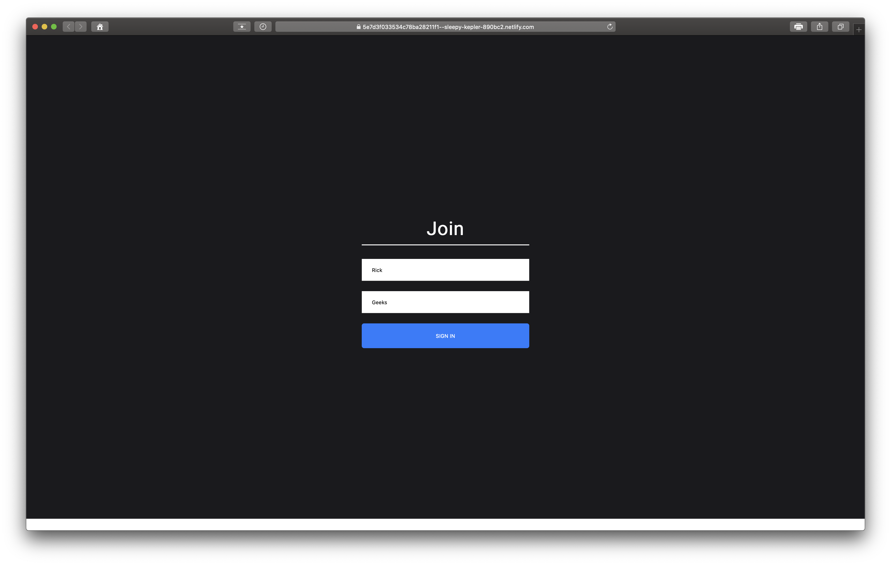
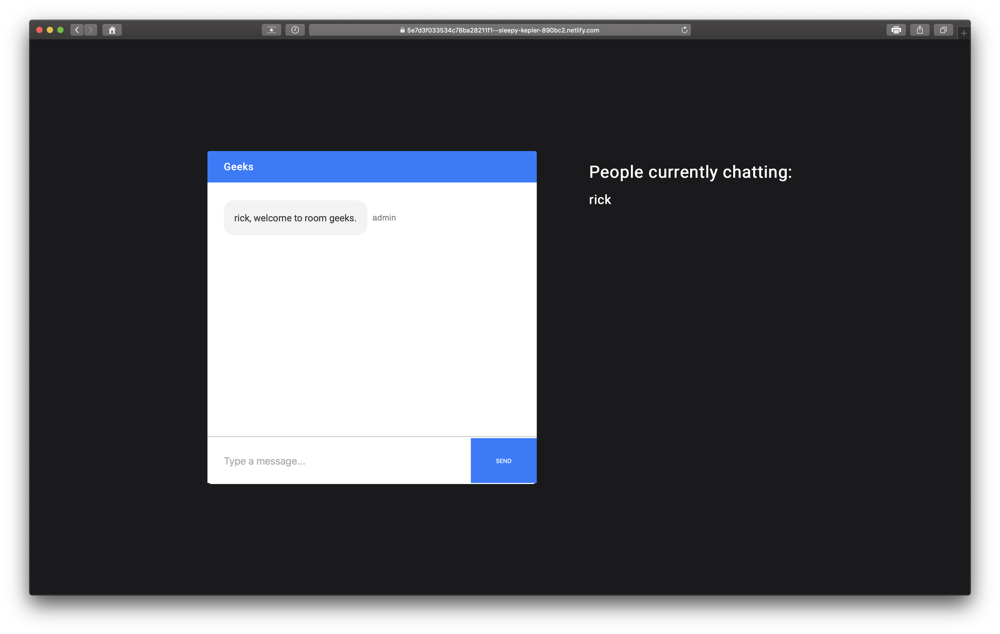
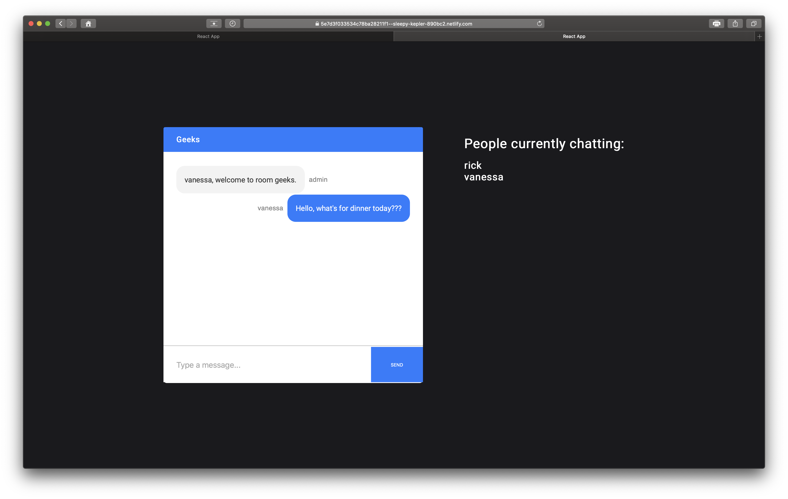
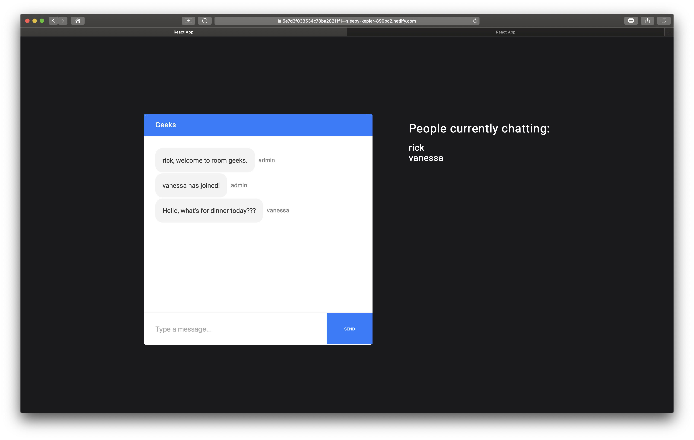

# Messaging-App

### Messaging-App is based off a video turotial by JavaScript Mastery (https://www.youtube.com/watch?v=ZwFA3YMfkoc&t=6304s)
## I was inspired to do the turorial to learn about socket.io. Communication is one of the most practical and powerful things technology has given us the ability to do; and so I naturally had a curiosity about it. The app is a simple Messaging App that let's users join rooms and chat we each other. 

## Technologies used:
1. ReactJs
2. NodeJs
3. Express
4. Socket.io
5. NPM

### The application works by allowing users to join chat rooms with their desired usernames. Users are notified of whom is in the chat room at any given time on a separate column. Messages sent/received are labeled with corresponding user.

## Visit the live site at : https://5e7d3f033534c78ba28211f1--sleepy-kepler-890bc2.netlify.com

